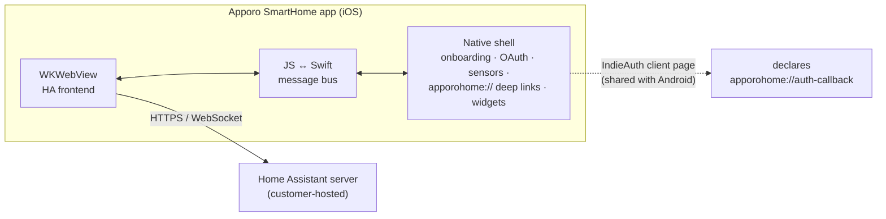

<p align="center">
  
</p>

<h1 align="center">Apporo SmartHome — iOS App</h1>

<p align="center">
  <strong>White-label Home Assistant companion app for the Apporo SmartHome ecosystem</strong><br/>
  iOS counterpart of <a href="https://github.com/WOOWTECH/Woow_apporo_ha_app">Woow_apporo_ha_app</a> (Android)
</p>

<p align="center">
  <a href="#overview">Overview</a> &bull;
  <a href="#architecture">Architecture</a> &bull;
  <a href="#screenshots">Screenshots</a> &bull;
  <a href="#building">Building</a> &bull;
  <a href="#verification-status">Verification</a> &bull;
  <a href="README_zh-TW.md">中文文件</a>
</p>

<p align="center">
  
  
  
  
</p>

---

## Overview

**Apporo SmartHome iOS** is a white-label build of the official
[Home Assistant Companion app](https://github.com/home-assistant/iOS), produced by the
one-shot rebrand toolkit in the shared base
[`woow_ha_ios`](https://github.com/WOOWTECH/woow_ha_ios) — the same pipeline as
[`Woow_simon_ha_ios`](https://github.com/WOOWTECH/Woow_simon_ha_ios) and
[`Woow_woowtech_ha_ios`](https://github.com/WOOWTECH/Woow_woowtech_ha_ios).
Brand parameters are ported 1:1 from the Android `apporo.conf` (grill session
2026-08-10), including the accessibility color decision.

| | |
|---|---|
| **Bundle ID** | `com.apporo.home` (Release) / `com.apporo.home.dev` (Debug) — aligned with Android |
| **URL scheme** | `apporohome://` (deep links + OAuth callback) |
| **OAuth client** | `https://woowtech.github.io/Woow_apporo_ha_app/android` (shared with Android; live, declares `apporohome://auth-callback`) |
| **Brand color** | `#8B6B24` — WCAG-AA adjusted (brand swatch `#C49E53` fails white-text contrast at 2.50:1; `#8B6B24` passes at 4.88:1, per Android ADR-0001) |
| **App icon** | mark-only bird emblem on white (`#FFFFFF`), wordmark stripped per icon/wordmark separation rules |
| **Upstream pin** | `home-assistant/iOS` tag `release/2026.7.3/2026.2546` |

## Architecture



One client_id page serves both platforms — Home Assistant servers validate the OAuth
redirect against it (IndieAuth). Fork topology, toolkit design, and environment notes:
see the base repo's [README](https://github.com/WOOWTECH/woow_ha_ios#readme).
Divergence from upstream is ledgered in [`docs/fork-divergence.md`](docs/fork-divergence.md).

## Screenshots

| Upstream baseline | Apporo onboarding |
|---|---|
|  |  |
| The unmodified upstream app built from the pinned tag (toolchain baseline). | After the one-shot rebrand: Apporo bird mark, name, copy, `#8B6B24` deep-gold accent — brand-clean native shell. |

## Building

Same environment as all brands in this family (details in the
[base repo](https://github.com/WOOWTECH/woow_ha_ios#local-build-environment)):
Xcode 26.6+, watchOS platform downloaded, Homebrew CocoaPods (+`cocoapods-acknowledgements`),
swiftlint/swiftformat.

```bash
pod install
DEVELOPER_DIR=/Applications/Xcode.app/Contents/Developer \
xcodebuild -workspace HomeAssistant.xcworkspace -scheme App-Debug \
  -destination 'platform=iOS Simulator,name=iPhone 17' build
```

## Verification Status

| Stage | Status |
|---|---|
| Rebrand (3 934 strings / 34 locales, 79 asset sets) + preflight 66/66 | ✅ 2026-08-16 |
| Simulator build + branded onboarding | ✅ 2026-08-16 |
| Live server OAuth end-to-end, physical device, 8-category smoke | ⏳ pending |

## License & Attribution

Modified distribution of Home Assistant Companion for iOS, © Home Assistant
contributors — [Apache License 2.0](LICENSE.md). Upstream attribution and the in-app
open-source acknowledgements page are preserved.
