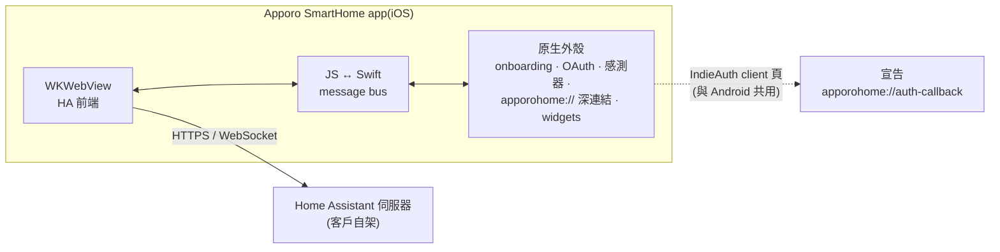
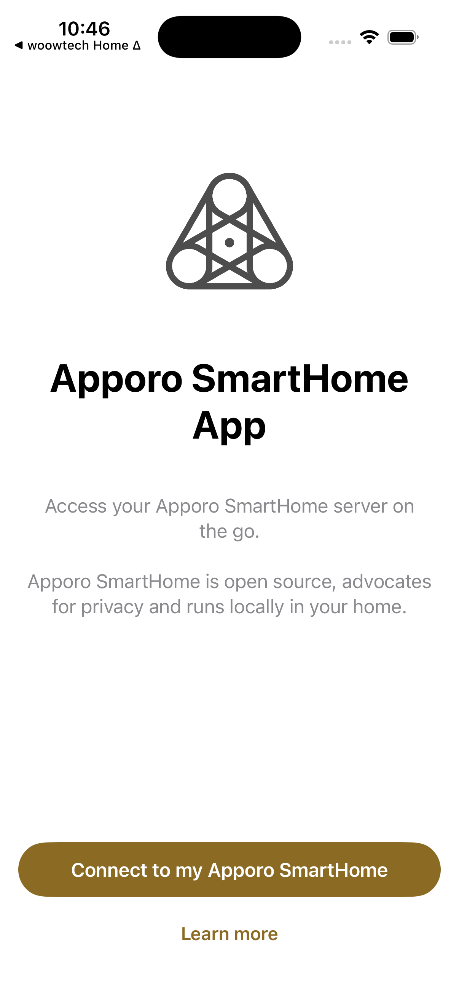

<p align="center">
  
</p>

<h1 align="center">Apporo SmartHome — iOS App</h1>

<p align="center">
  <strong>Apporo SmartHome 生態系的白牌 Home Assistant 隨行 App</strong><br/>
  <a href="https://github.com/WOOWTECH/Woow_apporo_ha_app">Woow_apporo_ha_app</a>(Android)的 iOS 對應版
</p>

<p align="center">
  <a href="#總覽">總覽</a> &bull;
  <a href="#架構">架構</a> &bull;
  <a href="#截圖">截圖</a> &bull;
  <a href="#編譯">編譯</a> &bull;
  <a href="#驗證狀態">驗證</a> &bull;
  <a href="README.md">English</a>
</p>

<p align="center">
  
  
  
  
</p>

---

## 總覽

**Apporo SmartHome iOS** 是官方
[Home Assistant Companion](https://github.com/home-assistant/iOS) 的白牌版本,
由共用基底 [`woow_ha_ios`](https://github.com/WOOWTECH/woow_ha_ios) 的一鍵換裝工具組
產出——與 [`Woow_simon_ha_ios`](https://github.com/WOOWTECH/Woow_simon_ha_ios)、
[`Woow_woowtech_ha_ios`](https://github.com/WOOWTECH/Woow_woowtech_ha_ios) 同一條管線。
品牌參數 1:1 移植自 Android `apporo.conf`(2026-08-10 grill 定案),
包含無障礙色彩決策。

| | |
|---|---|
| **Bundle ID** | `com.apporo.home`(Release)/ `com.apporo.home.dev`(Debug)——與 Android 對齊 |
| **URL scheme** | `apporohome://`(深連結 + OAuth callback) |
| **OAuth client** | `https://woowtech.github.io/Woow_apporo_ha_app/android`(與 Android 共用;已上線、宣告 `apporohome://auth-callback`) |
| **品牌色** | `#8B6B24`——WCAG AA 修正色(品牌色票 `#C49E53` 白字對比 2.50:1 不合格;`#8B6B24` 為 4.88:1 合格,依 Android ADR-0001) |
| **App icon** | 去字鳥形 mark、白底(`#FFFFFF`),依 icon/wordmark 分工規則 |
| **上游 pin** | `home-assistant/iOS` tag `release/2026.7.3/2026.2546` |

## 架構



一頁 client_id 服務雙平台——HA 伺服器以 IndieAuth 方式向它驗證 OAuth redirect。
fork 拓撲、工具組設計、環境筆記見基底 repo
[README](https://github.com/WOOWTECH/woow_ha_ios/blob/main/README_zh-TW.md);
與上游偏離記錄於 [`docs/fork-divergence.md`](docs/fork-divergence.md)。

## 截圖

| 上游基準線 | Apporo onboarding |
|---|---|
|  |  |
| pin tag 直接編出的官方原版(工具鏈基準)。 | 一鍵換裝後:Apporo 鳥形 mark、名稱、文案、`#8B6B24` 深金主色,原生外殼零殘留。 |

## 編譯

環境與全家族相同(細節見
[基底 repo](https://github.com/WOOWTECH/woow_ha_ios/blob/main/README_zh-TW.md#本機編譯環境)):
Xcode 26.6+、watchOS platform、brew CocoaPods(+`cocoapods-acknowledgements`)、
swiftlint/swiftformat。

```bash
pod install
DEVELOPER_DIR=/Applications/Xcode.app/Contents/Developer \
xcodebuild -workspace HomeAssistant.xcworkspace -scheme App-Debug \
  -destination 'platform=iOS Simulator,name=iPhone 17' build
```

## 驗證狀態

| 階段 | 狀態 |
|---|---|
| 換裝(3 934 條字串 / 34 語系、79 組資產)+ preflight 66/66 | ✅ 2026-08-16 |
| 模擬器編譯 + 品牌 onboarding | ✅ 2026-08-16 |
| 實伺服器 OAuth 全鏈路、實機、8 大類冒煙 | ⏳ 待辦 |

## 授權與致謝

Home Assistant Companion for iOS 之修改發行版,© Home Assistant contributors——
[Apache License 2.0](LICENSE.md)。上游署名與 app 內開源致謝頁完整保留。
